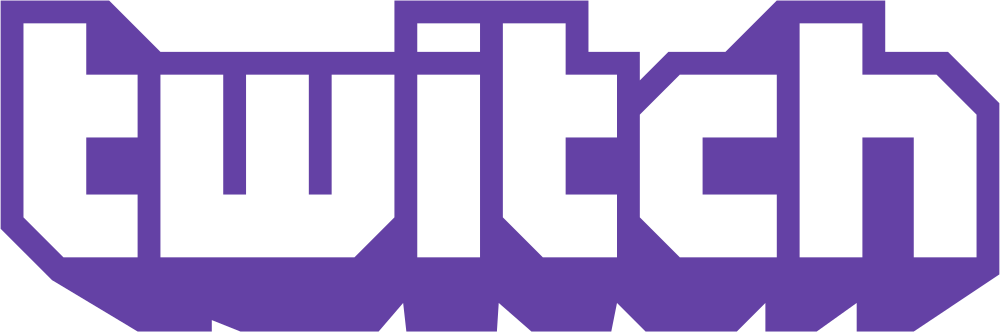

# Engenharia de Requisitos
Repositório criado para versionamento dos artefatos produzidos para a disciplina de Requisitos de Software do Curso de Engenharia de Software da Universidade de Brasília, no primeiro semestre de 2018.

## Equipe de Requisitos de Software

|Nome|E-mail|GitHub|
|----|------|------|
|Amanda Vieira Pires|amandoca_779@hotmail.com|[@pAmanda](https://github.com/pAmanda)|
|Filipe Dias Soares Lima|lipao.dias@hotmail.com|[@filypsdias](https://github.com/filypsdias)|
|Gabriel Gomes Ziegler|gabrielziegler3@gmail.com|[@gabrielziegler3](https://github.com/gabrielziegler3)|
|Gustavo Barbosa Carvalho|gustavocarvalho1002@gmail.com|[@gustavocarvalho1002](https://github.com/gustavocarvalho1002)|
|João Carlos Porto dos Reis|joao4018@gmail.com|[@joao4018](https://github.com/joao4018)|
|Thiago Ferreira|thiagoiferreira@outlook.com|[@TPFChaos](https://github.com/TPFChaos)|

## A Plataforma Twitch.tv
A Twitch é uma plataforma de live streaming destinada ao streaming de jogos digitais. A Twitch foi lançada em 2011 como uma plataforma externa ao hoje extinto, justin.tv. Em 2014 a Twitch foi adquirida pela Amazon e em 2016, esta teve os serviços da Curse, Inc incorporados à plataforma.