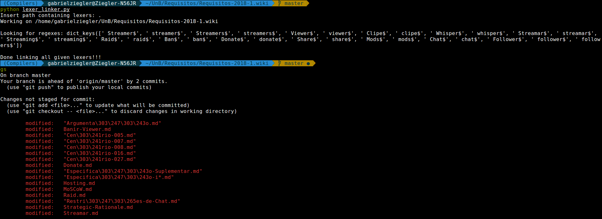
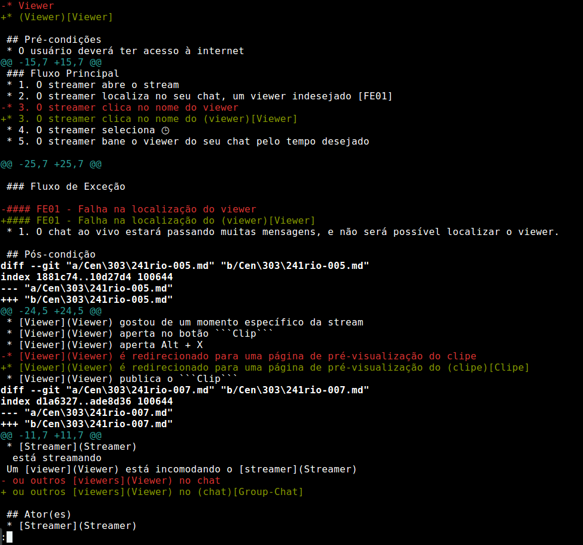

## Inspeção de cenários e léxicos

Para que todos os termos que aparecem em [Léxico](Léxico) fossem linkados de forma rápida e eficiente, os membros utilizaram de *scripts* que automatizaram esse processo.

O passo a passo do processo pode ser analisado abaixo:

### 1. Execução do *script* e `git status` para checar alterações

### 2. Uso do `git diff` para checar se alterações estão corretas

