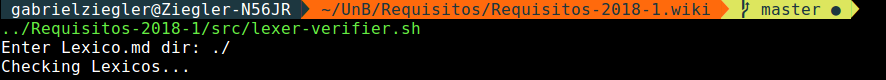
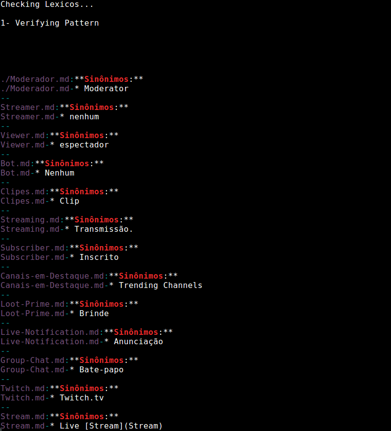
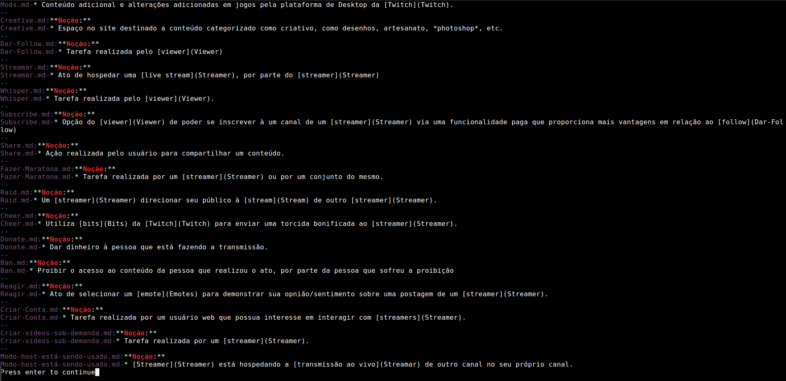
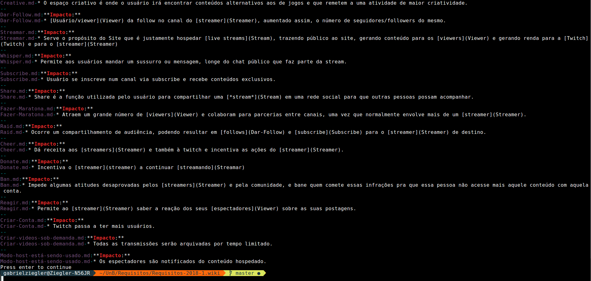

|Data|Versão|Descrição|Autor|
|----|------|---------|-----|
|27/05/2018|0.1|Criação do Documento|Gabriel Ziegler|
|29/05/2018|0.2|Adição de processo de verificação dos Léxicos|Gabriel Ziegler|
|04/06/2018|0.3|Adição de processo de verificação dos Cenários|Gabriel Ziegler|

# Inspeção de cenários e léxicos

As inspeções de cenários e léxicos foram feitas de forma semi-automatizada, como é explicado a seguir.

## Cenários

Para que os padrões de conteúdo e de estruturação dos [cenários](Cenários) fosse verificado, foi utilizado de um [script](https://github.com/gabrielziegler3/Requisitos-2018-1/blob/master/src/lexer-verifier.sh) para semi-automatizar a tarefa com intuito de agilizar o processo e reduzir as possíveis falhas humanas no processo de verificação.

O passo a passo da verificação semi-automatizada dos cenários:

### 1. Inserção do diretório em que o script deve executar

### 2. Verificação dos conteúdos de sinônimos dos cenários

### 3. Verificação das noções dos cenários

### 4. Verificação dos impactos dos cenários

## Léxico

Para que todos os termos que aparecem em [Léxico](Léxico) fossem linkados de forma rápida e eficiente, os membros utilizaram de um [script](https://github.com/gabrielziegler3/Requisitos-2018-1/blob/master/src/lexer_linker.py) que automatizou esse processo.

O passo a passo do processo de verificação dos léxicos pode ser analisado abaixo:

### 1. Execução do *script* e `git status` para checar alterações

### 2. Uso do `git diff` para checar se alterações estão corretas

## Scripts utilizados

[lexer-verifier.sh](https://github.com/gabrielziegler3/Requisitos-2018-1/blob/master/src/lexer-verifier.sh) script em escrito `bash` por [Gabriel Ziegler](https://github.com/gabrielziegler3) em 27/05/18

[lexer_linker.py](https://github.com/gabrielziegler3/Requisitos-2018-1/blob/master/src/lexer_linker.py) script em escrito `python` por [Gabriel Ziegler](https://github.com/gabrielziegler3) em 27/05/18