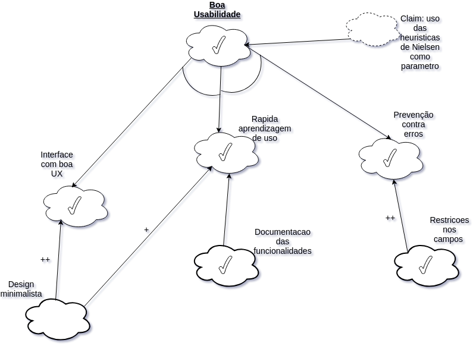

|Data|Versão|Descrição|Autor|
|----|------|---------|-----|
|05/05/2018|1.0|Criação do Documento|Gustavo Carvalho|
|05/05/2018|1.1|Adicionando NFR USVV|João Carlos Porto|
|06/05/2018|1.2|Adição de NFR USXX|Gabriel Ziegler|
|06/05/2018|1.3|Adição de NFR USWW|Amanda Pires|
|06/05/2018|1.4|Adição de NFR USZZ|Thiago Ferreira|
|06/05/2018|1.4|Adição de NFR USTT|Filipe Dias|

### USXX

### USYY

### USZZ

### USWW

### USVV

### USTT

