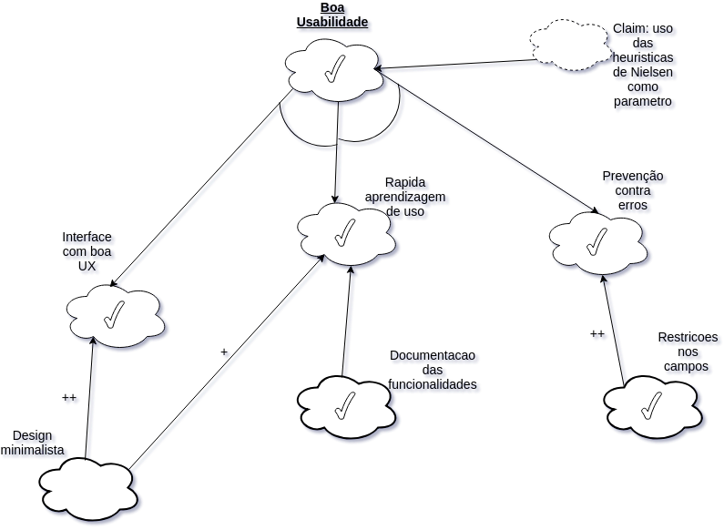

|Data|Versão|Descrição|Autor|
|----|------|---------|-----|
|05/05/2018|1.0|Criação do Documento|Gustavo Carvalho|
|05/05/2018|1.1|Adicionando NFR US53|João Carlos Porto|
|06/05/2018|1.2|Adição de NFR US48|Gabriel Ziegler|
|06/05/2018|1.3|Adição de NFR US52|Amanda Pires|
|06/05/2018|1.4|Adição de NFR US51|Thiago Ferreira|
|06/05/2018|1.4|Adição de NFR US49|Filipe Dias|
|06/05/2018|1.5|Adição de NFR US50|Gustavo Carvalho|

### US48

### US49

### US50

### US51

### US52

### US53

