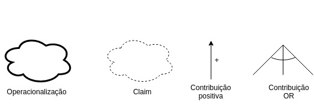
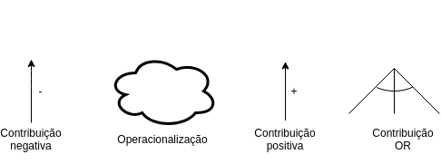
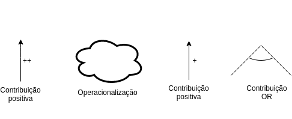
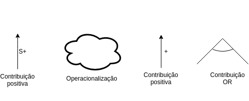
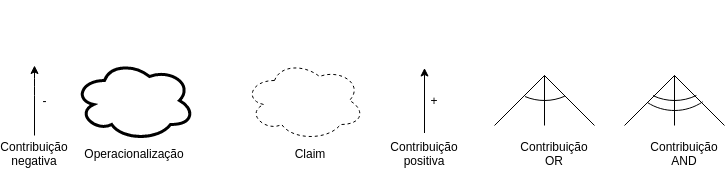
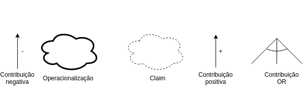

|Data|Versão|Descrição|Autor|
|----|------|---------|-----|
|05/05/2018|1.0|Criação do Documento|Gustavo Carvalho|
|05/05/2018|1.1|Adição NFR US53|João Carlos Porto|
|06/05/2018|1.2|Adição de NFR US48|Gabriel Ziegler|
|06/05/2018|1.3|Adição de NFR US52|Amanda Pires|
|06/05/2018|1.4|Adição de NFR US51|Thiago Ferreira|
|06/05/2018|1.4|Adição de NFR US49|Filipe Dias|
|06/05/2018|1.5|Adição de NFR US50|Gustavo Carvalho|
|07/05/2018|1.6|Adição de versão 1.1 do NFR US48|Gabriel Ziegler|
|07/05/2018|1.7|Adição de versão 1.1 do NFR US52|Amanda Pires|
|07/05/2018|1.8|Adição de versão 1.1 do NFR US49|Filipe Dias|
|07/05/2018|1.9|Adição de versão 1.1 do NFR US51|Thiago Ferreira|
|07/05/2018|2.0|Adição de versão 1.1 do NFR US50|Gustavo Carvalho|
|27/05/2018|2.1|Adição de legendas aos NRFs e alterando definição e escopo|Amanda Pires

<h1>Introdução</h1>

## 1.1 Finalidade

Este documento tem como finalidade apresentar o NFRs da plataforma [Twich.tv](https://www.twitch.tv/).

## 1.2 Definição

NFR é um framework conceitual orientado aos requisitos não funcionais, os quais são considerados “cidadãos” de primeira ordem. O modelo utilizado no NFR Framework é chamado Softgoal Interdependency Graph (SIG). O SIG é abstraído em um diagrama formado por Softgoal (requisito de qualidade), argumentação, impactos, legenda e operacionalização.

## 1.3 Escopo

Nessa conjuntura, serão construídos NFRs dos seguintes requisitos não funcionais:

* Usabilidade
* Performance
* Segurança
* Portabilidade
* Disponibilidade

<h1>NFRs</h1>

### US48 - Usabilidade

[NFR Usabilidade 1.0](images/NFR_US48.png)

### `Legenda`

### US49 - Performance para o Usuário 
<a href="https://raw.githubusercontent.com/gabrielziegler3/Requisitos-2018-1/master/imagens/Imagens_NFR/NFR_US49.jpg">NFR Performance Tráfego 1.0</a>

### `Legenda`

### US50 - Segurança
<a href="https://github.com/gabrielziegler3/Requisitos-2018-1/blob/master/imagens/Imagens_NFR/NFR_US50.png">NFR Segurança em Transações 1.0</a>

### `Legenda`

### US51- Performance para a Stream

### `Legenda`

### US52 - Portabilidade
[NFR US52 1.0](https://raw.githubusercontent.com/gabrielziegler3/Requisitos-2018-1/master/imagens/Imagens_NFR/NFR_US52.jpg)

### `Legenda`

### US53 - Disponibilidade
[NFR US53 1.0](https://raw.githubusercontent.com/gabrielziegler3/Requisitos-2018-1/master/imagens/Imagens_NFR/NFR_53.png)

### `Legenda`

