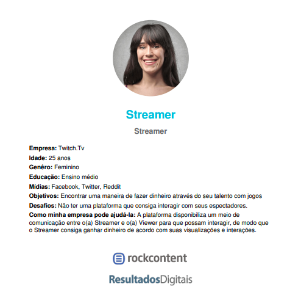

### 1. Plano de Elicitação

|Data|Versão|Descrição|Autor|
|----|----|----|----|
|26/05/18|0.1|Plano de Elicitação|Filipe Dias|

### Índice

* 1 Plano de Elicitação 

__________

#### 1. Plano de Elicitação

Na primeira etapa do Plano de Elicitação fora consultada fontes de informações por cada integrante da equipe, onde tais desenvolvem sua própria compreensão do domínio da aplicação. Através dessa compreensão, fora possível, aos leigos em relação a plataforma, identificar como funciona a interação entre os usuários e a <a href="https://github.com/gabrielziegler3/Requisitos-2018-1/wiki/Twitch">Twitch</a>.  A utilização dos RichPicture's e a Argumentações gerados, é de grande valia nessa etapa do planejamento. Por isso, é de extrema necessidade registrar e documentar qualquer modificação significativa para o projeto.

A segunda etapa fora composta ao todo de duas técnicas: A <a href="https://github.com/gabrielziegler3/Requisitos-2018-1/wiki/H%C3%ADbrido-(An%C3%A1lise-de-Protocolo--&-Observa%C3%A7%C3%A3o-Participativa)">Análise de Protocolo e Observação Participativa</a> através de uma mistura entre as duas, ocasionando numa técnica Híbrida. O objetivo principal era de entender como a plataforma funcionava como um todo e manter registrado todas as ideias e experiências que tenham a ver com a aplicação. A partir disso, será possível desenvolver ainda mais a compreensão do domínio. 

Na terceira etapa o uso de Questionário, Storytelling e Introspecção são os pontos cruciais. O objetivo é obter dados de forma clara e direta para que se possa trabalhar sobre. Além disso, outro objetivo é a resolução de conflitos que alguns requisitos possam apresentar durante o envolvimento dos Stakeholders. Tais técnicas implicam em um maior entendimento dos Stakeholders e do domínio.

_________

### 1.1 Técnicas Utilizadas
[Questionário](https://github.com/gabrielziegler3/Requisitos-2018-1/wiki/Questionario)
[Introspecção](https://github.com/gabrielziegler3/Requisitos-2018-1/wiki/Introspec%C3%A7%C3%A3o)
[Observação Participativa](https://github.com/gabrielziegler3/Requisitos-2018-1/wiki/H%C3%ADbrido-(An%C3%A1lise-de-Protocolo--&-Observa%C3%A7%C3%A3o-Participativa))
[MoSCoW](https://github.com/gabrielziegler3/Requisitos-2018-1/wiki/MoSCoW)
[Análise de Protocolo](https://github.com/gabrielziegler3/Requisitos-2018-1/wiki/H%C3%ADbrido-(An%C3%A1lise-de-Protocolo--&-Observa%C3%A7%C3%A3o-Participativa))
_________

## Personas
* Ferramenta utilizada: [Gerador de Personas](https://geradordepersonas.com.br/)

