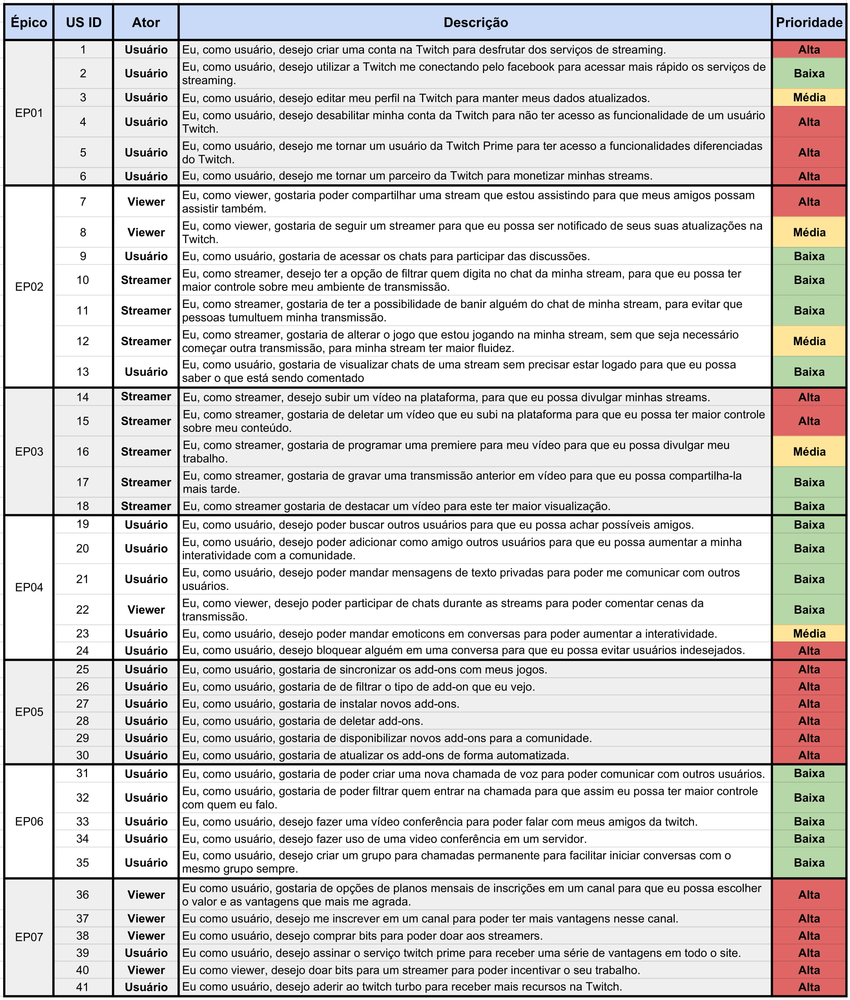

|Data|Versão|Descrição|Autor|
|----|------|---------|-----|
|24/04/2018|1.0|Criação do Documento |Thiago Ferreira|
|24/04/2018|1.1|Adição das US do EP04|Gustavo Carvalho|
|24/04/2018|1.2|Adição das US's do EP03,EP05 e EP06|Thiago Ferreira|
|24/04/2018|1.3|Adição das US do EP01|Amanda Pires|
|25/04/2018|1.4|Adição das US do EP02|Gabriel Ziegler|
|25/04/2018|1.5|Adição das US do EP07|João Carlos Porto|
|25/04/2018|1.6|Revisão dos épicos|Gustavo Carvalho e Gabriel Ziegler|
|25/04/2018|1.7|Adição de tipos de Requisitos|Filipe Dias|
|25/04/2018|1.8|Adicionando ordenação e pré-reastreabilidade|Amanda Pires|
|29/04/2018|1.8|Atualizando temas|Amanda Pires|
|01/05/2018|1.9|Atualizando prioridades|Filipe Dias|
|26/05/2018|2.0|Adcionando critérios de aceitação nas US|Gustavo Carvalho|
|27/05/2018|2.1|Colocando as US no formato:  ``` As <persona> , I want <what?> so that <why?> ```|Gustavo Carvalho|
|27/05/2018|2.2|Adição tabela geral|Gustavo Carvalho|

Este Artefato será composto pelos Épicos do projeto da Twitch, estes sendo divididos em histórias de usuário que compõe cada épico.

## Tabela Geral

[Link tabela em alta definição](https://raw.githubusercontent.com/wiki/gabrielziegler3/Requisitos-2018-1/images/Tabela_Geral_Product_Backlog.jpg)



## Temas
* 1. Cadastro = [EP01](#ep01---eu-como-usu%C3%A1rio-desejo-gerenciar-meu-cadastro-na-twitch)
* 2. Stream = [EP02](#ep02---eu-como-usu%C3%A1rio-desejo-usufruir-servi%C3%A7os-relacionados-a-streaming-na-twitchtv) e & [EP03](#ep03---eu-como-usu%C3%A1rio-desejo-gerenciar-um-v%C3%ADdeo-na-twitchtv-para-visualiza%C3%A7%C3%A3o-da-comunidade)
* 3. Comunicação = [EP06](#ep06---eu-como-usu%C3%A1rio-desejo-poder-fazer-uso-de-confer%C3%AAncias-de-voz-para-me-comunicar-com-outras-pessoas) e [EP04](#ep04---eu-como-usuário-desejo-me-comunicar-com-outros-usuários)
* 4. Add-ons [EP05](#ep05---eu-como-usu%C3%A1rio-desejo-gerenciar-add-ons-pela-twitch-para-usufruir-de-maiores-funcionalidades-em-determinados-jogos)
* 5. Finanças = [EP07](#ep07---eu-como-usu%C3%A1rio-desejo-poder-contribuir-financeiramente-com-canais-e-com-a-twitch-para-incentivar-eou-recompensar-pelo-entretenimento-fornecido)

## Épicos

|Épico|Descrição|Para que|
|----|---------|---|
|EP01|Eu, como usuário, desejo gerenciar meu cadastro na twitch.|Eu possa ter um maior controle sobre minha conta|
|EP02|Eu, como usuário, desejo usufruir serviços relacionados a streaming na twitch.tv|Eu tenha a melhor experiência com streams|
|EP03|Eu, como usuário, desejo gerenciar um vídeo na twitch.tv| Tenha um maior controle do conteúdo postado.|
|EP04|Eu, como usuário, desejo me comunicar com outros usuários |Haja maior interatividade entre os usuários.|
|EP05|Eu, como usuário, desejo gerenciar add-ons pela twitch|Eu possa usufruir de maiores funcionalidades em determinados jogos|
|EP06|Eu, como usuário, desejo poder fazer uso de conferências de voz|seja possível se comunicar com outras pessoas|
|EP07|Eu, como usuário, desejo poder contribuir financeiramente com canais e com a twitch|Eu possa incentivar e/ou recompensar pelo entretenimento fornecido.|

## Histórias de Usuário


#### EP01 - Eu, como usuário, desejo gerenciar meu cadastro na twitch.

|Tipo|História|Descrição|Critérios de Aceitação|Pontuação|Prioridade|
|----|----|---------|-------|-----|-----|
|RF|US01|Eu, como usuário, desejo [criar uma conta](Cen%C3%A1rio-002) na Twitch para desfrutar dos serviços de streaming.|Ter os seguintes campos no formulário inscrição: nome de usuário, email, data de nascimento e senha.<br>Possuir captcha |8|Alta|
|RNF|US02|Eu, como usuário, desejo utilizar a Twitch me conectando pelo facebook para acessar mais rápido os serviços de streaming.|Opções de poder logar com o Facebook devem estar disponíveis nas áreas de "login" e "cadastra-se".|5|Baixa|
|RF|US03|Eu, como usuário, desejo [editar meu perfil](Cen%C3%A1rio-023) na Twitch para manter meus dados atualizados.|Dados atuais devem aparecer previamente nos campos de edição como máscara.|5|Média|
|RF|US04|Eu, como usuário, desejo desabilitar minha conta da Twitch para não ter acesso as funcionalidade de um usuário Twitch.|Senha deve ser digitada novamente para que a conta seja desativida|3|Alta|
|RF|US05|Eu, como usuário, desejo me tornar um usuário da [Twitch Prime](Assinar-Twitch-Prime) para ter acesso a funcionalidades diferenciadas do Twitch.|O usuário deve ter a opção de pagar usando algum meio de pagamento, ou simplesmente utilizar da Twitch Prime como meio.|13|Alta|
|RF|US06|Eu, como usuário, desejo me tornar um parceiro da Twitch para monetizar minhas streams.|Streamers devem ter "x" quantidade de vizualições.|20|Alta|

#### EP02 - Eu, como usuário, desejo usufruir serviços relacionados a streaming na twitch.tv

|Tipo|História|Descrição|Critérios de Aceitação|Prioridade|
|----|----|---------|---|-----|
|RF|US07|Eu, como viewer, gostaria poder [compartilhar uma stream](Cen%C3%A1rio-030) que estou assistindo para que meus amigos possam assistir também.|Um botão "compartilhar" deve estar embaixo de todas as streams, onde o usuário, poderá escolher a plataforma de compartilhamento, ou simplesmente copiar o link da stream.|Alta|
|RF|US08|Eu, como viewer, gostaria de seguir um streamer para que eu possa ser notificado de seus suas atualizações na Twitch.|Ao seguir um streamer, o contador de seguidores do mesmo, deverá ser atualizado, assim como a lista de "canais seguidos" do viewer.|Média|
|RF|US09|Eu, como usuário, gostaria de acessar os chats para participar das discussões.|Alguns chats devem ter limitações para não seguidores.|Baixa|
|RF|US10|Eu, como streamer, desejo ter a opção de filtrar quem digita no chat da minha stream, para que eu possa ter maior controle sobre meu ambiente de transmissão.|Poder colocar limitação de tempo em relação a participação de usuários.|Baixa|
|RF|US11|Eu, como streamer, gostaria de ter a possibilidade de [banir alguém](Cen%C3%A1rio-027) do chat de minha stream, para evitar que pessoas tumultuem minha transmissão.|Pessoas indesejadas pelo streamer não poderão participar do chat de uma live específica, ou de uma canal.|Baixa|
|RF|US12|Eu, como streamer, gostaria de alterar o jogo que estou jogando na minha stream, sem que seja necessário começar outra transmissão, para minha stream ter maior fluidez. | - |Média|
|RF|US13|Eu, como usuário, gostaria de visualizar chats de uma stream sem precisar estar logado para que eu possa saber o que está sendo comentado|Usuários não logados não poderão enviar mensagens.|Baixa|

#### EP03 - Eu, como usuário, desejo gerenciar um vídeo na twitch.tv para visualização da comunidade


|Tipo|História|Descrição|Critérios de Aceitação|Prioridade|
|-----|----|---------|---|---|
|RF|US14|Eu, como streamer, desejo subir um vídeo na plataforma, para que eu possa divulgar minhas streams. |Arquivos corrompidos devem ser negados. <br> Vídeos para 'upload' devem ser comprimidos ou otimizados para facilitar seu armazenamento.|Alta|
|RF|US15|Eu, como streamer, gostaria de deletar um vídeo que eu subi na plataforma para que eu possa ter maior controle sobre meu conteúdo.|Uma verificação de dois passos é necessária, para que exclusões acidentais não ocorra.|Alta|
|RF|US16|Eu, como streamer, gostaria de programar uma premiere para meu vídeo para que eu possa divulgar meu trabalho.| - |Média|
|RF|US17|Eu, como streamer, gostaria de gravar uma transmissão anterior em vídeo para que eu possa compartilha-la mais tarde.| - |Baixa|
|RF|US18|Eu, como streamer gostaria de destacar um vídeo para este ter maior visualização.| - |Baixa|

#### EP04 - Eu, como usuário, desejo me comunicar com outros usuários

|Tipo|História|Descrição|Critérios de Aceitação|Prioridade|
|----|----|-----|-----|-----|
|RF|US19|Eu, como usuário, desejo poder buscar outros usuários para que eu possa achar possíveis amigos.| Poder buscar tanto com caixa alta ou não. Informar quando não achar um usuário correspondente a busca.|Baixa|
|RF|US20|Eu, como usuário, desejo poder adicionar como amigo outros usuários para que eu possa aumentar a minha interatividade com a comunidade.| Poder somente enviar pedidos de amizades para pessoas que não me bloquearam|Baixa|
|RF|US21|Eu, como usuário, desejo poder mandar [mensagens de texto privadas](Mensagens-Privadas) para poder me comunicar com outros usuários.| Poder selecionar o usuário de destino.|Baixa|
|RF|US22|Eu, como viewer, desejo poder participar de chats durante as streams para poder comentar cenas da transmissão.| Se uma transmissão acabar o chat deve acabar também. |Baixa|
|RF|US23|Eu, como usuário, desejo poder mandar emoticons em conversas para poder aumentar a interatividade.| Um conjunto de caracteres, ou somente um, deve corresponder a um emoticon.|Média|
|RF|US24|Eu, como usuário, desejo bloquear alguém em uma conversa para que eu possa evitar usuários indesejados.| Um usuário bloqueado não pode ter mais a capacidade de achar o bloqueador.|Alta|


#### EP05 - Eu, como usuário, desejo gerenciar add-ons pela Twitch para usufruir de maiores funcionalidades em determinados jogos

|Tipo|História|Descrição|Critérios de Aceitação|Prioridade|
|----|------|----------|----|----|
|RF|US25|Eu, como usuário, gostaria de [sincronizar os add-ons](Adi%C3%A7%C3%A3o-de-Add-ons-em-Jogos) com meus jogos.| - |Alta|
|RF|US26|Eu, como usuário, gostaria de de filtrar o tipo de add-on que eu vejo.| - |Alta|
|RF|US27|Eu, como usuário, gostaria de instalar novos add-ons.| - |Alta|
|RF|US28|Eu, como usuário, gostaria de deletar add-ons.| - |Alta|
|RNF|US29|Eu, como usuário, gostaria de disponibilizar novos add-ons para a comunidade.| - |Alta|
|RNF|US30|Eu, como usuário, gostaria de atualizar os add-ons de forma automatizada.| - |Alta|

#### EP06 - Eu, como usuário, desejo poder fazer uso de conferências de voz para me comunicar com outras pessoas

|Tipo|História|Descrição|Critérios de Aceitação|Prioridade|
|----|----|---------|-|-|
|RF|US31|Eu, como usuário, gostaria de poder criar uma nova chamada de voz para poder comunicar com outros usuários.|Limitação de até 5 pessoas.|Baixa|
|RF|US32|Eu, como usuário, gostaria de poder filtrar quem entrar na chamada para que assim eu possa ter maior controle com quem eu falo.|Usuários só poderão entrar em uma chamada por meio de um link, ou se convidados.|Baixa|
|RF|US33|Eu, como usuário, desejo fazer uma vídeo conferência para poder falar com meus amigos da twitch. |Limitação de até 5 pessoas. <br> Resolução HD|Baixa|
|RF|US34|Eu, como usuário, desejo fazer uso de uma video  conferência em um servidor.| - |Baixa|
|RF|US35|Eu, como usuário, desejo criar um grupo para chamadas permanente para  facilitar iniciar conversas com o mesmo grupo sempre.|Possibilidade de gerenciar grupos (deletar, editar, criar).|Baixa|

#### EP07 - Eu, como usuário, desejo poder contribuir financeiramente com canais e com a Twitch, para incentivar e/ou recompensar pelo entretenimento fornecido

|Tipo|História|Descrição|Critérios de Aceitação|Prioridade|
|----|----|---------|--|---|
|RNF|US36|Eu como viewer, gostaria de opções de planos mensais de inscrições em um canal para que eu possa escolher o valor e as vantagens que mais me agrada.|Oferecer opções mensais, trimestrais e semestrais. <br> Possibilidade de pagar com cartão de crédito, transferência bancaria ou dinheiro.|Alta|
|RF|US37|Eu como viewer, desejo me inscrever em um canal para poder ter mais vantagens nesse canal.|Opção de se inscrever devem estar visíveis junto a stream. <br> Ter a possibilidade de uma avaliação gratuita ao se inscrever.|Alta|
|RF|US38|Eu como viewer, desejo comprar bits para poder doar aos streamers.|Oferecer pacotes de bits, e não a venda unitária.|Alta|
|RNF|US39|Eu como usuário, desejo assinar o serviço twitch prime para receber uma série de vantagens em todo o site.|Assinantes da Amazon Prime poderão ter acesso a Twtich Prime por meio de uma validação de login da Amazon|Alta|
|RF|US40|Eu como viewer, desejo doar bits para um streamer para poder incentivar o seu trabalho.|Poder escolher a quantidade de bits|Alta|
|RF|US41|Eu como usuário, desejo aderir ao twitch turbo para receber mais recursos na Twitch.|Anuncios não poderão aparecer para aqueles que aderirem ao Twitch Turbo. <br>  |Alta|