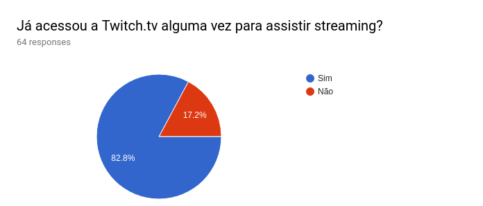
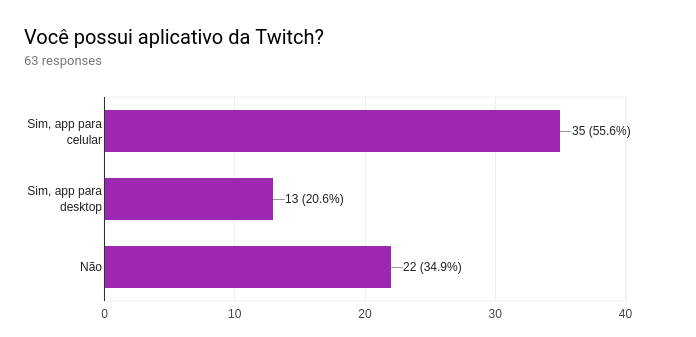
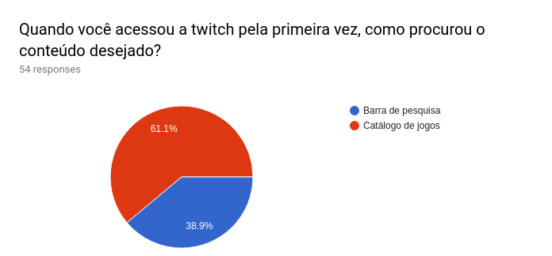
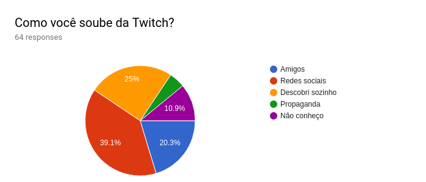
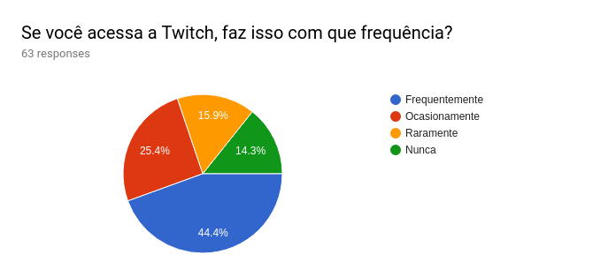

## Questionário

## O Questionário
O Questionário, foi feito levando em conta algumas informações básicas que, poderiam ajudar-nos no levantamento de requisitos, buscando de certa forma, nos dar dados sobre um determinado padrão de uso que seria observado dentro da plataforma. Os dados que foram levantados, não estavam anteriormente disponíveis em outros locais que possuiam dados relativos à twitch, logo, buscando caracterizar algumas características não mapeadas do site. O Questionário foi elaborado de forma a ser fácil de responder e não ser maçante para a pessoa que estaria respondendo, contendo este poucas perguntas, sendo estas o mais objetivas possíveis.
### Autores
* [Gustavo Carvalho](https://github.com/gustavocarvalho1002)
* [Thiago Ferreira](https://github.com/TPFChaos)

<b>Data:</b>01/04/2018  
<b>Técnica:</b>Questionário