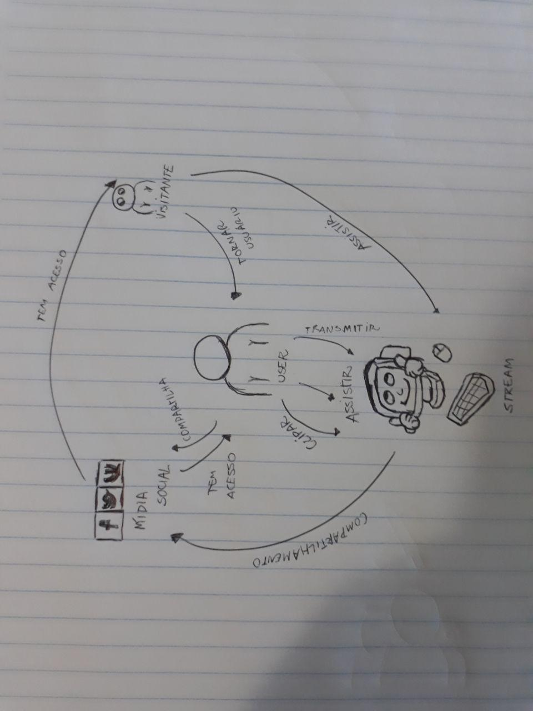

|Data|Versão|Descrição|Autor|
|----|------|---------|-----|
|01/04/2018|1.0|Criação do Documento|Gustavo Carvalho|
|01/04/2018|1.1|Desenvolvimento dos RichPictures|João Carlos, Filipe Dias|
|01/04/2018|1.2|Referenciação de links dos RichPictures|Gustavo Carvalho|
|10/06/2018|1.3|Adição Geral 1.1 & Streamer 1.1|João Carlos|

## Rich Picture

## 1. Introdução

### 1.1. Definição

Rich Picture é uma técnica simples de modelagem com o objetivo de analisar problemas e expressar ideias. Das vantagens de se utilizar essa técnica, algumas serão citadas abaixo:

	* Rápida identificação de requisitos
	* Rápida identificacão de atores
	* Auxilia na análise de processos
	* Estabele relacionamentos entre atores
	* Fácil de modelar e pode ser feito com o cliente

### 1.2. Escopo

Para ter uma visão geral sobre a plataforma [Twitch](https://www.twitch.tv), inicialmente será apresentado um Rich Picture geral que aborda algumas das principais modalidades do site. Em seguida, serão apresentados os Rich Pictures para cada ator, para que seja possível detalhar as principais funcionalidades e seus atores.

### 1.3. Apresentação

### 1.3.1. [Twitch](Twitch)

[Geral 1.0](./images/rich-picture/Twitch-1.0.jpeg)

[Geral 1.1](.//images/rich-picture/Twitch-1.1.png)

### [Streamer](Streamer)
[Streamer 1.0](./images/rich-picture/streamer.jpeg)

### User 1.0

