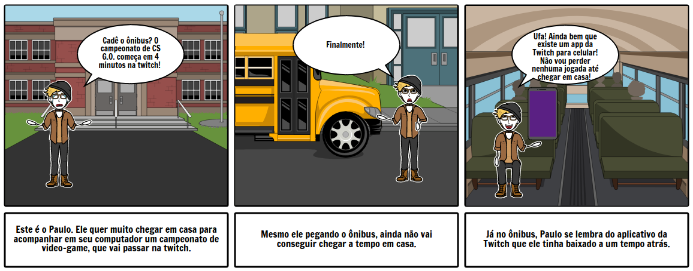
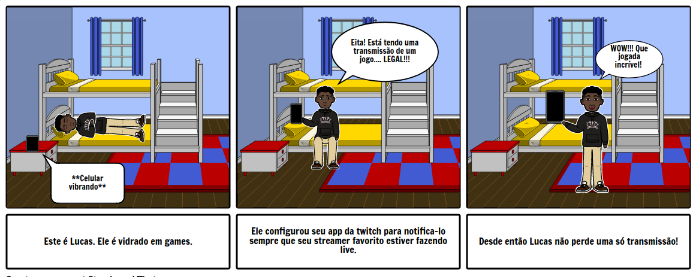

|Data|Versão|Descrição|Autor(es)|
|--|--|--|--|
|27/05/2018|1.0|Criação e desenvolvimento do documento|Gabriel Ziegler|
|11/06/2018|1.1|Revisão do documento|Filipe Dias|
|11/06/2018|1.2|Adição storyboard|Gustavo Carvalho|
|11/06/2018|1.3|Edição do documento|Filipe Dias|

# Storytelling

_____

_____

### 1. O que é Storytelling?

Storytelling é uma palavra em inglês, que está relacionada com uma narrativa e significa a capacidade de contar histórias relevantes. Ou seja, o uso de recursos audiovisuais juntamente com as palavras são utilizados de tal forma a promover algum negócio sem que haja a necessidade de fazer uma venda direta. A técnica consiste em contar uma história que, no caso acima, explique o funcionamento de algum produto ou seu o objetivo. 

### 2. Objetivo

O objetivo ao narrar a experiência de Jonas é de entender como pessoas podem ter conhecimento a respeito da plataforma <a href="https://github.com/gabrielziegler3/Requisitos-2018-1/wiki/Twitch">Twitch</a> e para que ela serve. No caso, pode-se entender que o objetivo principal da plataforma é a <a href="https://github.com/gabrielziegler3/Requisitos-2018-1/wiki/Stream">Stream</a>.

### 3. Ferramenta utilizada

* [Storytelling Creator](https://www.storyboardthat.com/storyboard-creator)

### 4. Resultados

* A partir da experiência de Jonas com seus amigos, é possível levantar os seguintes possíveis requisitos:

|Requisito|Tipo|
|----|----|
|[Clipar](https://github.com/gabrielziegler3/Requisitos-2018-1/wiki/Clipes) parte da [Stream](https://github.com/gabrielziegler3/Requisitos-2018-1/wiki/Stream)|Funcional|
|Compartilhar [Clipe](https://github.com/gabrielziegler3/Requisitos-2018-1/wiki/Clipes)|Funcional|
|Cortar [Clipes](https://github.com/gabrielziegler3/Requisitos-2018-1/wiki/Clipes)|Não Funcional|
|Quantidade de [Clipes](https://github.com/gabrielziegler3/Requisitos-2018-1/wiki/Clipes) ilimitadas|Não Funcional|
|Portabilidade Mobile|Não funcional|
|Download pelo app do celular|Não Funcional|
|Receber notificações|Funcional|
|Conversar em um chat privado|Funcional|

### 5. Fontes:
* [O que é storytelling?](https://novaescolademarketing.com.br/marketing/o-que-e-storytelling/)

* [Significado de Storytelling](https://www.significados.com.br/storytelling/)

