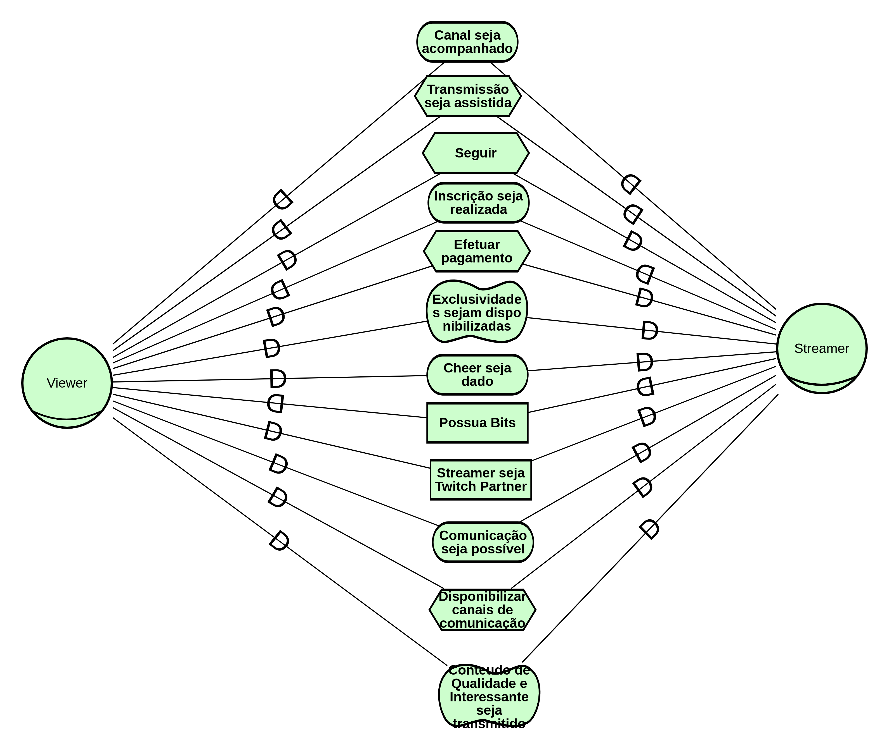

|Data|Versão|Descrição|Autor|
|----|------|---------|-----|
|12/05/2018|0.1|Criação do Documento|Gustavo Carvalho|
|12/05/2018|0.2|Adição diagrama viewer-streamer|Gustavo Carvalho|
|12/05/2018|0.3|Adição diagrama twitch-usuário|Gustavo Carvalho|
|12/05/2018|0.4|Adição diagrama geral 1.0 |Gustavo Carvalho|
|12/05/2018|0.5|Adição do diagrama twitch-patrocinador |Amanda Pires|
|12/05/2018|0.6|Adição do diagrama patrocinador-streamer |Amanda Pires|
|13/05/2018|0.7|Adição diagrama geral 1.1 |Gustavo Carvalho , Amanda Pires|
|13/05/2018|0.8|Adição do diagrama viewer-twitch |Filipe Dias|
|13/05/2018|0.8|Adição do diagrama twitch-streamer |Filipe Dias|
|15/05/2018|0.9|Adição diagrama viewer-streamer 1.1 |João Carlos Porto|
|15/05/2018|1.0|Adição diagrama geral 1.2 |Gustavo Carvalho|
|15/05/2018|1.1|Adição do diagrama viewer-twitch 1.1 |Gustavo Carvalho|
|15/05/2018|1.2|Adição do diagrama twitch-streamer 1.1 |Gustavo Carvalho|
|15/05/2018|1.3|Adição do diagrama geral 1.3 |Gustavo Carvalho|
|15/05/2018|1.4|Adição do diagrama 2.0 twitch-usuario e correções pequenas ao modelo twitch-viewer |Thiago Ferreira|
|15/05/2018|1.4|Adição do diagrama 3.0 Twitch-Usuário e Viewer-Streamer 2.0|Thiago Ferreira|

## Geral 1.3

[Geral 1.3](./images/iStar/strategic-dependecy/geral-1-3.png)

[Geral 1.2](./images/iStar/strategic-dependecy/geral-1-2.png)

[Geral 1.1](./images/iStar/strategic-dependecy/geral-1-1.png)

[Geral 1.0](./images/iStar/strategic-dependecy/geral-1-0.png)

## Viewer - Streamer 2.0

[Viewer - Streamer 1.0](./images/iStar/strategic-dependecy/viewer-streamer.png)
[Viewer - Streamer 1.1](./images/iStar/strategic-dependecy/viewer-streamer1.1.png)
[Viewer - Streamer 2.0](./images/iStar/strategic-dependecy/viewer-streamer-2.0.png)

## Twitch - Usuário 2.0

[Twitch - Usuário 1.0](./images/iStar/strategic-dependecy/twitch-usuario.png) 
[Twitch - Usuário 2.0](./images/iStar/strategic-dependecy/twitch-usuario-2.0.png) 
[Twitch - Usuário 3.0](./images/iStar/strategic-dependecy/twitch-usuario-3.0.png)
## Twitch - Patrocinador 1.0

## Patrocinador - Streamer 1.0

## Viewer - Twitch 1.1

[Viewer - Twitch 1.0](./images/iStar/strategic-dependecy/viewer-twitch.png)

## Streamer - Twitch 1.1

[Streamer - Twitch 1.1](./images/iStar/strategic-dependecy/twitch-streamer-1-1.png)

[Streamer - Twitch 1.0](./images/iStar/strategic-dependecy/twitch-streamer.png)

