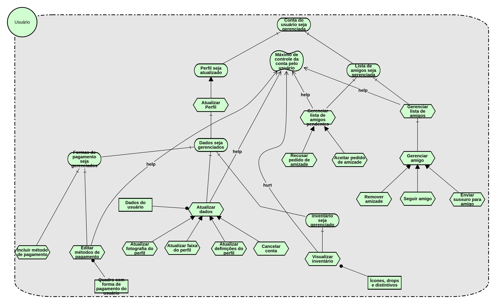
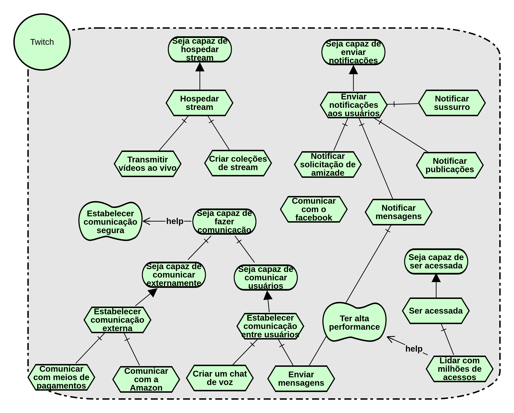

|Data|Versão|Descrição|Autor|
|----|------|---------|-----|
|12/05/2018|0.1|Criação do Documento|Gabriel Ziegler|
|12/05/2018|0.2|Adição de SR de Streamer versão 1.0|Gabriel Ziegler|
|12/05/2018|0.3|Adição de SR da Twitch|Amanda Pires|
|13/05/2018|0.4|Adição de SR de Streamer versão 1.1|Gabriel Ziegler|
|13/05/2018|0.5|Adição de SR de Usuário versão 1.0|João Carlos|
|13/05/2018|0.6|Adição de SR de Visitante versão 1.0|João Carlos|
|14/05/2018|0.7|Adição de SR de Visitante versão 1.1|João Carlos|

[Ferramenta utilizada para a modelagem i*](http://www.cin.ufpe.br/~jhcp/pistar/)

## Usuário

[Usuario 1.0](./images/iStar/strategic-rationale/Usuario.png)

## Streamer

[Streamer 1.0](./images/iStar/strategic-rationale/streamer-1.0.png)

## Twitch

## Visitante

