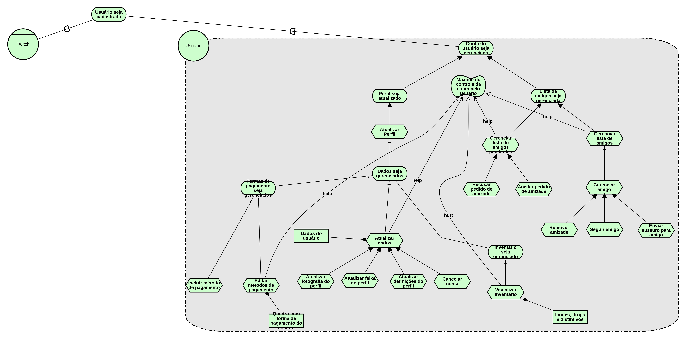

|Data|Versão|Descrição|Autor|
|----|------|---------|-----|
|12/05/2018|0.1|Criação do Documento|Gabriel Ziegler|
|12/05/2018|0.2|Adição de SR de [Streamer](Streamer) versão 1.0|Gabriel Ziegler|
|12/05/2018|0.3|Adição de SR da Twitch|Amanda Pires|
|13/05/2018|0.4|Adição de SR de [Streamer](Streamer) versão 1.1|Gabriel Ziegler|
|13/05/2018|0.5|Adição de SR de Usuário versão 1.0|João Carlos|
|13/05/2018|0.6|Adição de SR de Visitante versão 1.0|João Carlos|
|14/05/2018|0.7|Adição de SR de Usuário versão 1.1|João Carlos|
|15/05/2018|0.8|Adição de SR de Usuário versão 1.2|João Carlos|
|15/05/2018|0.9|Adição de SR da Twitch 2.0|Thiago Ferreira|
|16/05/2018|1.0|Adição de SR do [Viewer](Viewer) 1.0|Amanda Pires|
|16/05/2018|1.1|Adição de SR do Usuário 1.3|João Carlos|

[Ferramenta utilizada para a modelagem i*](http://www.cin.ufpe.br/~jhcp/pistar/)

## Usuário

[Usuario 1.2](./images/iStar/strategic-rationale/usuario-1.2.png)

[Usuario 1.1](./images/iStar/strategic-rationale/usuario-1.1.png)

[Usuario 1.0](./images/iStar/strategic-rationale/Usuario.png)

## [Streamer](Streamer)

[Streamer 1.0](./images/iStar/strategic-rationale/streamer-1.0.png)

## Twitch

[Twitch - 1.0](./images/iStar/strategic-rationale/twitch.png) 
[Twitch - 2.0](./images/iStar/strategic-rationale/twitch-2.0.png)

## Visitante

## Viewer

$$